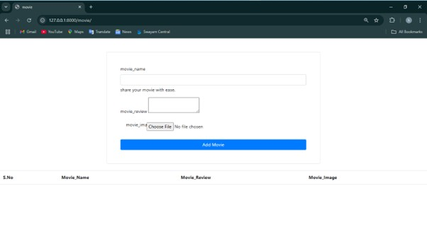
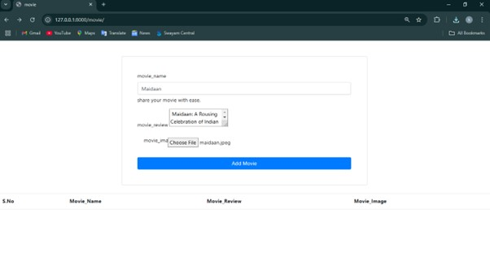
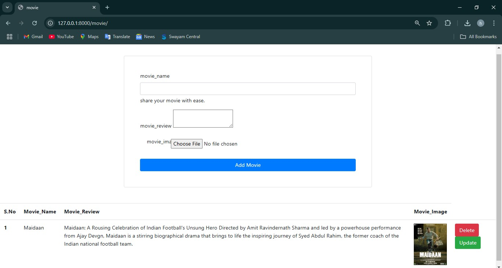

# Description
A movie review system which takes user reviews about a movie and stores it in a database.

# Screenshots
<p align="center">
  
  
  
</p>


# Usage
1. Copy the code to your local machine.
2. Make sure the Django framework is installed.
3. Open Command prompt in project folder.
4. Start the Django web-server.
```
python manage.py runserver
```
5.Open 127.0.0.1:8000/movie in your web browser.
